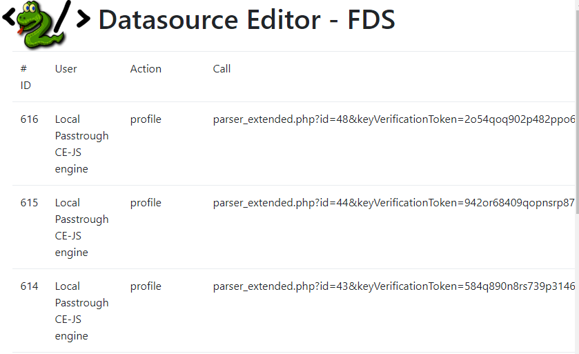
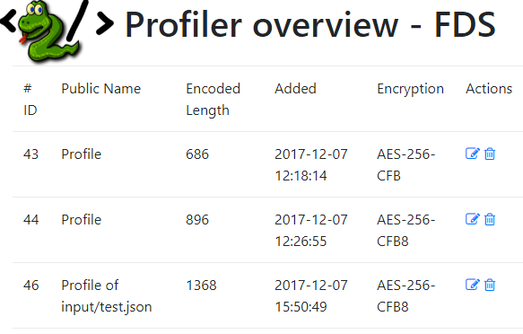
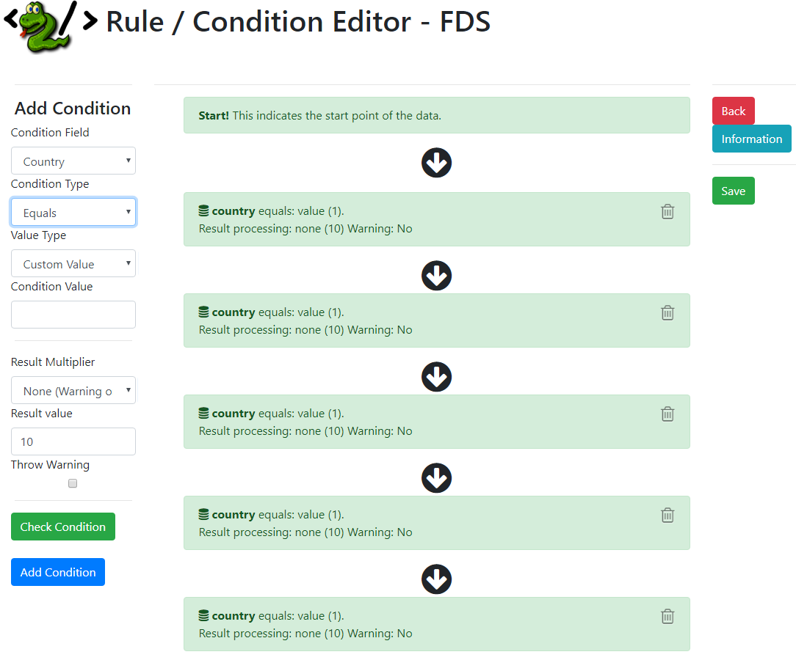
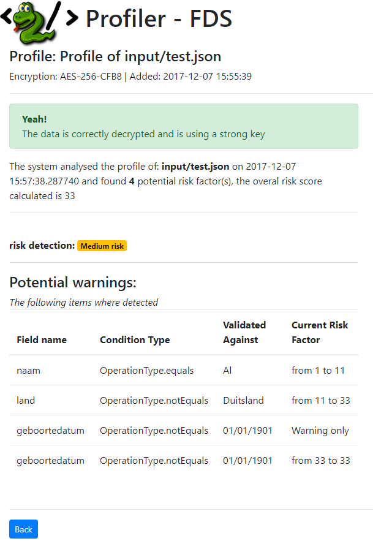
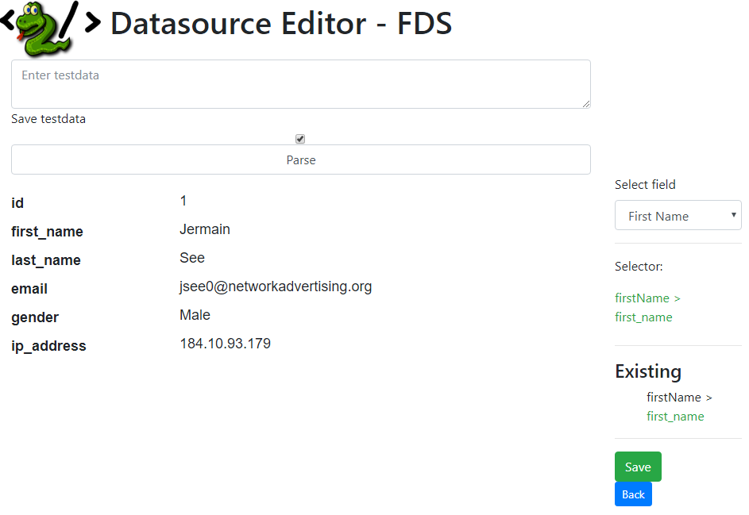
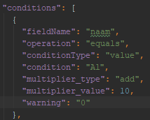

# About the software
This software can be used to detect risks in a death insurance application. You need to enter information about the person who wants to get the insurance. The system will check if there are any risks with accepting this person. If there are any risks found, the system will raise a warning and tell the user why.

This system will check with 2 different subsystems to give the most accurate results. The first checks are business rules. These rules will be matched with the incoming data and a score will be generated. After this check, the generated profile will be scored with machine learning. The software returns the combined result to the user. This is a total score from both tests.

_Disclaimer: We are not responsible for misuse of the software and its output. It should not be used for excluding or filtering people using racist or other discriminating conditions.
The output of the software should not be used as a final decision. The system indicates a potential risk and returns the score based on the user-defined rules and machine learning. It is not decisive._

## Security 
All the data is encrypted with Advanced Encryption Standard 256 Cipher Block Chaining. This means that the data is not readable with other tools than this software. Only the tools that are delivered by the software can read this data.

For more information about this encryption:
https://en.wikipedia.org/wiki/Advanced_Encryption_Standard 

The login system uses a lockout policy. Be aware that the account will be temporarily unavailable after too many login failures. The default settings are 10 tries, the account will be locked for the next 15 minutes.

This application has been made with the mindset: “All input is evil”. This means that defacing the GUI is not allowed and will be filtered to normal input.

# Getting started
## Condition config file
To use this software, you need to have a configuration file in JSON-format with the ruleset. This ruleset is required for the business rules. The configuration file can be created with the module “Condition Editor”. The user can create their own rules and save the configuration file.

It is not possible to manually edit the file. This file has been encrypted and can only be created / modified in the supported module.

Possible conditions: empty / not empty, min / max length, equals, not equals, greater than, smaller than, range, contains, is true, is false.

This is the interface where the user can edit the conditions.

All the properties are located on the left side of the field. The user can add properties to a condition. The condition flow is shown next to the properties.

- __Condition field__: The condition field is the field the condition applies to.
- __Condition type__: This is the check that indicates whether a condition meets the expectation.
- __Value type__: Each condition has a value.
- __Condition value__: This is the value that will be applied if the condition is evaluated to ‘true’.
- __Result multiplier__: What will happen if the condition evaluated to ‘true’, just add the score, or throw a warning.
  
  
The configuration file is in JSON format. This file has the following fields:

When opening the program folder there is a subfolder called “config”. You can copy/paste the file into this folder.

## Datasource control
In datasource control it is possible to match the fields from the software with the fields in the configuration file. The datasource control is an option to test your data and setup your file with the fields from the software.

All you need to do is select the field from the dropdown menu. The dropdown menu contains the fields from the software. When selected, you can click on the field that you want to match.

The webpage will show you all the collected matches. After saving, all the matches have been created.

## Results (Profiler)
The profiler has 2 options. The first option displays the results and the other option permanently deletes the profile.

When the software has finished all the operations. You will receive a profile that has been created in the profiler. This profile has tested the input with the given conditions and calculated the risk score. In the picture above, the tested person has a medium risk.

# Logging
The software has a built-in logging module. In this module you can find the handlings in the software. But when an exception occurs, it will be shown in the error log. The picture below shows the format of the logs:

Each log entry receives its own ID, this is a unique number. The user field shows the user who has generated the log (the user who was logged into the system). The action column shows what kind of action has been executed. At last, the call of the log itself. This gives you the information about the action that has been executed (in details).
